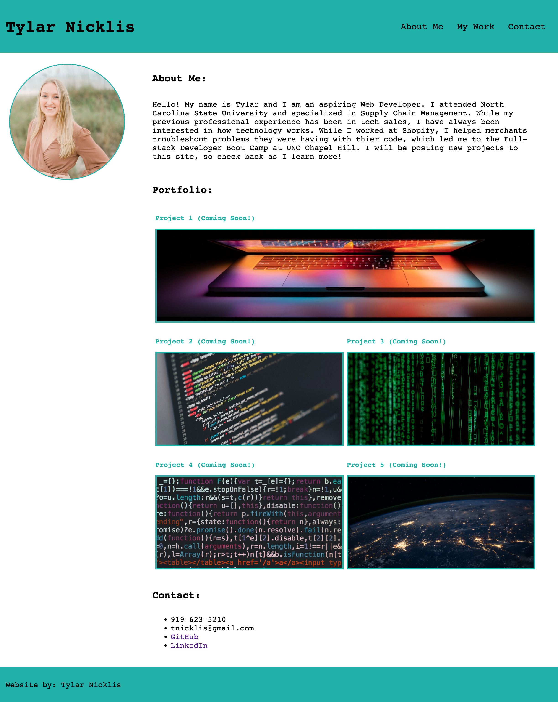

# Tylar Nicklis Portfolio

## Description
Challenge Activity Week 2: Build a Portfolio using advanced CSS concepts leaned in the UNC Coding Bootcamp. This project will be used in the future to showcase skills to future employers. I learned how to apply HTML and Advanced CSS concepts to build my own portfolio from stratch.

## Installation
You can view this code by exploring the files on GitHub, or pulling them into VS Code via Git in the CLI.

## Usage
You can use this website to learn more about me, view my work, and to find my contact information. You can access it via the deployed GitPages. 

## Credits 
Utilized information from W3Schools (https://www.w3schools.com/), StackOverflow, and ChatGPT.
I also consulted with a friend, Dylan Ellington, to complete this project.

## License
MIT License

Copyright (c) [2023] [TylarNicklis]

Permission is hereby granted, free of charge, to any person obtaining a copy
of this software and associated documentation files (the "Software"), to deal
in the Software without restriction, including without limitation the rights
to use, copy, modify, merge, publish, distribute, sublicense, and/or sell
copies of the Software, and to permit persons to whom the Software is
furnished to do so, subject to the following conditions:

The above copyright notice and this permission notice shall be included in all
copies or substantial portions of the Software.

THE SOFTWARE IS PROVIDED "AS IS", WITHOUT WARRANTY OF ANY KIND, EXPRESS OR
IMPLIED, INCLUDING BUT NOT LIMITED TO THE WARRANTIES OF MERCHANTABILITY,
FITNESS FOR A PARTICULAR PURPOSE AND NONINFRINGEMENT. IN NO EVENT SHALL THE
AUTHORS OR COPYRIGHT HOLDERS BE LIABLE FOR ANY CLAIM, DAMAGES OR OTHER
LIABILITY, WHETHER IN AN ACTION OF CONTRACT, TORT OR OTHERWISE, ARISING FROM,
OUT OF OR IN CONNECTION WITH THE SOFTWARE OR THE USE OR OTHER DEALINGS IN THE
SOFTWARE.
